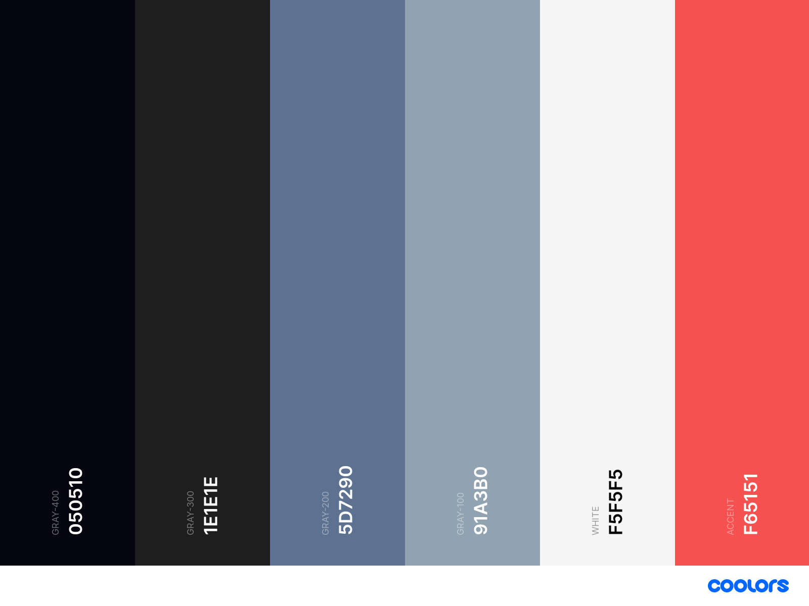

# Design Guidelines

This is a document which will guide you through custom styles, spacings and sizes and how to use fonts in the project.

# Table of contents

- [Typograhpy](#Typography)
  - [Fonts](#Fonts)
  - [Table](#Table)
- [Colors](#Colors)
  - [Pallete](#Pallete)
    - [Accent](#Accent)
    - [White](#White)
    - [Gray 100](#100)
    - [Gray 200](#200)
    - [Gray 300](#300)
    - [Gray 400](#400)
- [Spacing](#Spacing)

# Typography

Contrary to many applications, we use [two fonts](https://fonts.google.com/share?selection.family=Roboto:wght@400;700%7CUbuntu:wght@400;700) for the entire app.
And uses two weights, regular and bold.

## Fonts

`Roboto :`

[Roboto](https://github.com/googlefonts/roboto) is a font designed by Christian Robertson.
This font was chosen for it's strict, readable, formal and at the same time evergreen typeface.
This font should be used for :

- `Headers`
- `Buttons`
- `Toasts`

`Ubuntu :`
[Ubuntu](https://fonts.google.com/specimen/Ubuntu#standard-styles) is a font designed by [Dalton Maag](https://daltonmaag.com).
This font was chosen for it's casual, readable and good typeface.
This font should be used for :

- `Paragraphs`
- `Body Text`
- All forms of secondary texts unless specified as `font-sans` in `className`.

## Classes

Bold : `font-bold`

Roboto : `font-sans`

Ubuntu : `font-body`

## Table

| Tag           | Font Size | Weight |
| ------------- | --------- | ------ |
| **H1**        | 60px      | 700    |
| **H2**        | 48px      | 700    |
| **H3**        | 36px      | 700    |
| **H4**        | 30px      | 700    |
| **P**         | 24px      | 700    |
| **P (small)** | 20px      | 500    |

# Colors

## [Pallete](https://coolors.co/050510-1e1e1e-5d7290-91a3b0-f5f5f5-f65151)

## Accent : `#f65151`

## White : `#f5f5f5`

## Gray

### 100 : `#91a3b0`

### 200 : `#5d7290`

### 300 : `#1e1e1e`

### 400 : `#050510`

# Spacing

| Spacing | Size |
| ------- | ---- |
| 1       | 8px  |
| 2       | 12px |
| 3       | 16px |
| 4       | 24px |
| 5       | 32px |
| 6       | 48px |
