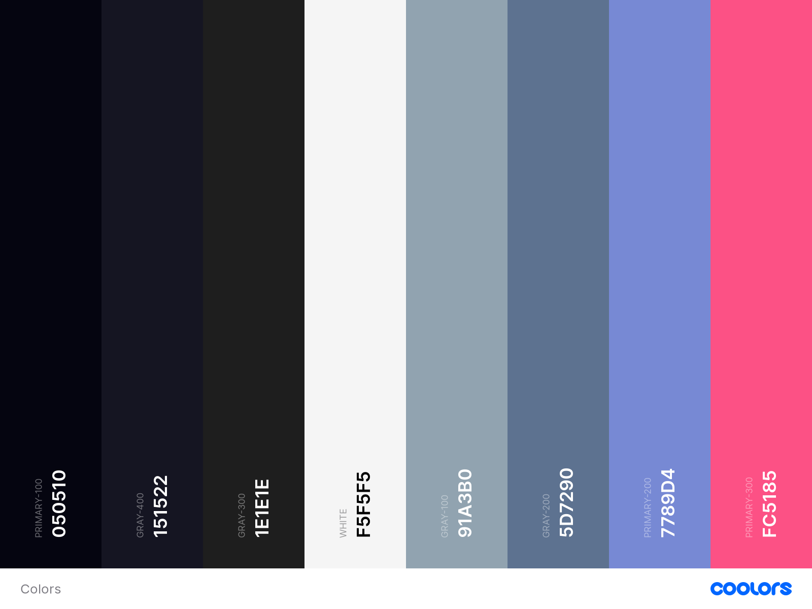

# Design Guidelines

This is a document which will guide you through custom styles, spacings and sizes and how to use fonts in the project.

# Table of contents

- [Typograhpy](#Typography)
  - [Fonts](#Fonts)
  - [Web Embeds](#Embeds)
  - [Table](#Table)
- [Colors](#Colors)
  - [Pallete](#Pallete)

# Typography

Contrary to many applications, we use [two fonts](https://fonts.google.com/share?selection.family=Roboto:wght@400;700%7CUbuntu:wght@400;500) for the entire app.
And uses two weights, regular and bold.

## Fonts

`Roboto :`

[Roboto](https://github.com/googlefonts/roboto) is a font designed by Christian Robertson.
This font was chosen for it's strict, readable, formal and at the same time evergreen typeface.
This font should be used for :

- `Headers`
- `Buttons`
- `Toasts`

`Ubuntu :`
[Ubuntu](https://fonts.google.com/specimen/Ubuntu#standard-styles) is a font designed by [Dalton Maag](https://daltonmaag.com).
This font was chosen for it's casual, readable and good typeface.
This font should be used for :

- `Paragraphs`
- `Body Text`
- All forms of secondary texts unless specified as `font-sans` in `className`.

## Web Embeds

HTML's `link` method.:

```html
<link rel="preconnect" href="https://fonts.gstatic.com" />
<link
  href="https://fonts.googleapis.com/css2?family=Roboto:wght@400;700&family=Ubuntu:wght@400;700&display=swap"
  rel="stylesheet"
/>
```

CSS `@import` :

```css
@import url("https://fonts.googleapis.com/css2?family=Roboto:wght@400;700&family=Ubuntu:wght@400;500&display=swap");
```

## Classes

Bold : `font-bold`

Roboto : `font-sans`

Ubuntu : `font-body`

## Table

| Tag           | Font Size | Weight     |
| ------------- | --------- | ---------- |
| **H1**        | 60px      | 700        |
| **H2**        | 48px      | 700        |
| **H3**        | 36px      | 700        |
| **H4**        | 30px      | 700        |
| **P**         | 24px      | 500 \| 700 |
| **P (small)** | 20px      | 500 \| 700 |

# Pallete



## Accent : `#050510`

## White : `#f5f5f5`

### `Example`

```tsx
export default function App() {
  return (
    <div className="bg-accent">
      <h1 className="text-white font-sans" />
      <p className="text-white font-body" />
    </div>
  );
}
```

## Primary

### 100(Pink) : `#fc5185`

### 200(Purple) : `#7789d4`

#### `Example`

```tsx
export default function App() {
  return (
    <div className="bg-accent">
      <h1 className="text-white font-sans" />
      <h3 className="text-primary-100" />
      <p className="text-white font-body" />
      <h4 className="text-primary-200" />
    </div>
  );
}
```

## Gray

### 100 : `#91a3b0`

### 200 : `#5d7290`

### 300 : `#1e1e1e`

### 400 : `#151522`

#### `Example`

```tsx
export default function App() {
  return (
    <div className="bg-accent">
      <h1 className="text-white font-sans" />
      <h3 className="text-primary-100" />
      <p className="text-white font-body" />
      <h4 className="text-primary-200" />
      <div className="bg-gray-100">
        <h1 />
        <div className="bg-gray-200">
          <h1 />
        </div>
        <div className="bg-gray-300">
          <h1 />
        </div>
        <div className="bg-gray-400">
          <h1 />
        </div>
      </div>
    </div>
  );
}
```
